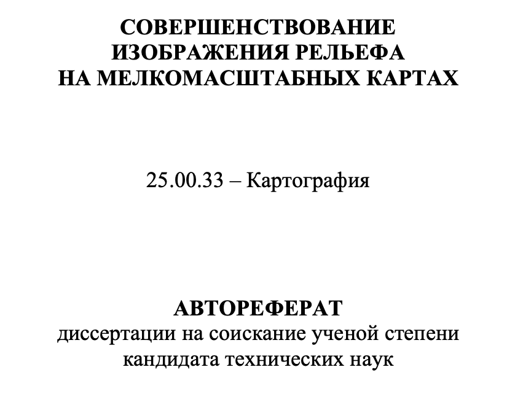
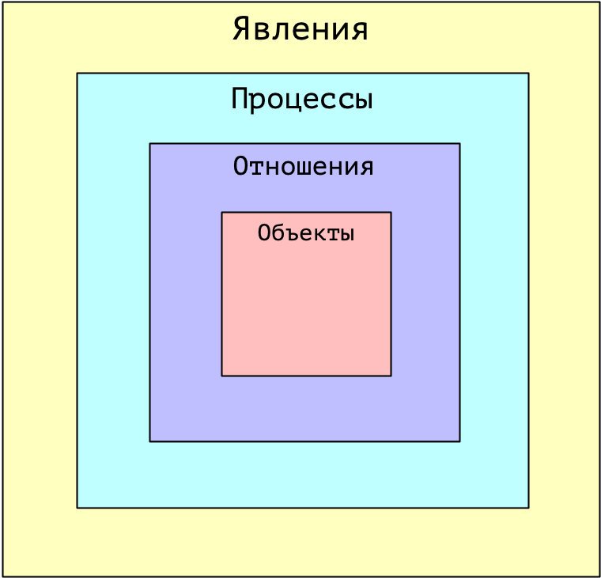

## Цель и задачи курса

Цель курса — развитие навыков ориентирования в современном поле научных и производственных достижений картографии, геоинформатики.

- __Самоидентификация картографа и геоинформатика__ в современном круге специалистов из области наук о Земле (Earth sciences) и компьютерных наук (Computer sciences). Кто такой картограф? Чем он отличается от географа или программиста? Есть ли разница между картографом и геоинформатиком?

- __Понимание спектра современного круга проблем__, которые решают картографы и геоинформатики в научной и производственной сфере. Каковы достижения тех специалистов, которые меня учат? Чем я могу заниматься в производственной сфере? Какими компетенциями я должен обладать для этого?

- __Осознанность в постановке и решении задач магистерской диссертации__. Почему я занимаюсь этим? Какую научную или производственную проблему я решаю? Не повторяю ли я то, что уже было сделано ранее? В чем будет мое достижение и новизна моего исследования? Какие навыки я смогу развить/получить?

---

## Структура курса

Курс построен в формате научного семинара. Каждую неделю слушаем и обсуждаем доклады.

Три типа докладчиков:

- Руководитель семинара
- Приглашенный докладчик (с кафедры или с внешней организации)
- Магистрант

---

## Доклад магистранта

Цель доклада — сформировать у себя и аудитории чёткое понимание того, что вы занимаетесь нужным делом, которое позволит решить актуальную научную или производственную проблему. Для этого необходимо:

1. Проанализировать современное состояние проблемы. Публикации, конкретные продукты (карты, ПО), которые имеют отношение к теме вашей работы. Выявить ту самую нерешенную задачу, которой вы решили заняться.

1. Выполнить питчинг идеи вашего исследования. Какая у вас будет новизна: методическая, технологическая, продуктовая, географическая? Почему мир изменится к лучшему, если вы выполните ваше исследование?

1. Представить подробный план решения проблемы и затрат на трудовые ресурсы. Продемонстрировать имеющиеся наработки (если есть).

> Бесплатный бонус: вы легко пройдёте аттестацию за 1 год магистратуры

---

## Доклад магистранта

1. Тема (направление исследований).

2. Цель исследования.

3. Подробный разбор ранее выполненных исследований.

4. Обоснование актуальности и новизны.

5. Объект и предмет исследования.

6. Задачи исследования.

7. План выполнения работы по месяцам.

8. Наработки (если имеются).

9. Заключение

---

## Объект и предмет исследования

Выделить объект и предмет исследования не так просто, поскольку они задаются относительно друг друга, неразрывно связаны друг с другом

.blue[_Предмет_] – это знание об объекте, аспект (проекция) объекта, выделенный в познании. Предмет задается через методы, подходы, противопоставление другим предметам.

.red[_Объект_] часто отождествляется с вещами и существующими феноменами и специфицируется относительно действий преобразования или познания. В то же время сам объект можно указать только через предмет (именно предмет задает объект).

Розин В.М. Понятия “предмет” и “объект” (методологический анализ) / В.М. Розин // Вопросы философии. – 2012. – № 11. – P. 85-96.

---

## Объект и предмет исследования

.pull-left[
__Цель и задачи диссертации.__ Целью исследования является совершенствование изображения рельефа на мелкомасштабных картах как актуального направления развития теории и практики оформления картографических произведений.

.red[__Объект и предмет исследования.__ Объектом исследования является рельеф земной поверхности и морского дна. Предмет исследования – картографическое изображение рельефа и методика создания достоверных и эстетически привлекательных картографических произведений.]
]

.pull-right[

.large[.red[__⬅︎ Что здесь не так?__]]
]

---

## Новизна

1. __Методическая:__ вы придумали новый метод и/или алгоритм, который позволил решить проблему.

2. __Технологическая:__ вы придумали, как именно можно реализовать предложенный вами или кем-то другим алгоритм с использованием тех или иных программных средств/библиотек/языков программирования, и _выполнили_ его реализацию.

3. __Продуктовая:__ вы впервые создали карту, программную библиотеку, веб-приложение, модель связи спектральной яркости и характеристик объектов, которые до вас никто не создавал или создавал с ограничениями.

4. __Географическая:__ вы получили новые/уточненённые знания об определенных географических объектах, явлениях, процессах и отношениях.

> Какая новизна будет у вас? А может быть все сразу?

---

## Методика, алгоритм, технология

_Методика и алгоритм индифферентны к средствам реализации. _

Если вы:

- упоминаете конкретные источники данных, программное обеспечение, язык программирования, 
- перечисляете пункты меню, кнопки, сайты, функции программных библиотек

то речь идет о __технологии__.

> Нельзя описать алгоритм и тем более метод решения задачи в ArcGIS или на языке Python. Как только ваше описание становится неприменимым для реализации другими средствами (QGIS и R, например) — это однозначный признак того, что вы описываете технологию.

---

## Методика, алгоритм, технология

.red[__Алгоритм__] — это инструкция, точное описание способа действия с использованием простых, общепонятных элементов (БРЭ). Конечная совокупность точно заданных правил решения некоторого класса задач или набор инструкций, описывающих порядок действий исполнителя для решения определённой задачи (Википедия).

Методику можно рассматривать как абстрактную последовательность действий, в которой каждый шаг требует дополнительного раскрытия в виде алгоритма для того чтобы его можно было реализовать в виде технологии. 

_Пример: изучить территорию, выбрать подходящие снимки за разные сезоны, выполнить дешифрирование растительности, оценить качество полученных результатов._

> Достаточно ли этого описания, чтобы написать программу, выполняющую эту последовательность действий? Если нет, то это не алгоритм, а методика 

---

## Методика, алгоритм, технология

Каждый шаг методики может быть подвергнут иерархической декомпозиции на вложенные шаги. Предел такой декомпозиции — это алгоритм, т.е. готовый перечень инструкций, который может быть однозначно сопоставлен функциям ПО или языка программирования.

Если вся методика алгоритмизирована, можно говорить о том, что вы придумали один большой алгоритм.

Однако в практических целях обычно говорят об алгоритмах, решающих одну узкоспециализированную задачу. Почему?

- Оценка производительности
- Применение на разных этапах методики
- Реализация наиболее удобными техническими средствами

> __Модульность!__

---

## Иерархия сущностей

.pull-left[
- __Объекты__ - условно неделимые в рамках исследования единицы

- __Отношения__ - связи, которые реально существуют между объектами или являются логическими абстракциями

- __Процессы__ - формируются в системе объектов в результате наличия между ними отношений

- __Явления__ - результаты процессов
]

.pull-right[

]

---

## Классический географ-картограф

Географ-картограф во времена традиционной (рукописной) картографии был уникальным специалистом. Он совмещал в себе следующие компетенции:

- Чертёжные, каллиграфические и художественные навыки. Мог выполнить составительский оригинал высокого качества.

- Общие географические знания. Обладал общей эрудицией в области Наук о Земле, что позволяло не допускать ошибок в изображении общегеографических элементов карт, выполнять их достоверную и наглядную генерализацию.

- Специальные географические знания. Обладал расширенными знаниями в области тематической специализации (рельеф, климат, промышленность, растительность и т.д.), что позволяло не допускать ошибок в изображении тематических элементов карт, выполнять их достоверную и наглядную генерализацию, творчески подходить к их изображению.
