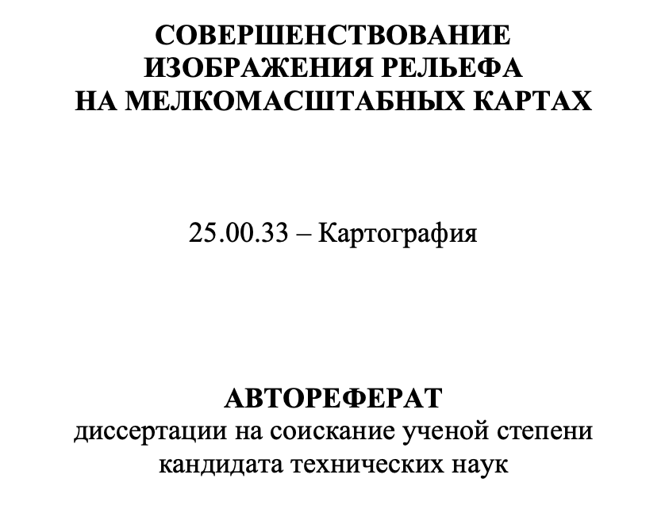

## Цель и задачи курса

Цель курса — позиционирование ваших профессиональных интересов в современном поле научных/производственных достижений/потребностей картографии, геоинформатики и аэрокосмического зондирования.

- __Осознанность в постановке и решении задач магистерской диссертации__. Почему я занимаюсь этим? Какую научную или производственную проблему я решаю? Не повторяю ли я то, что уже было сделано ранее? В чем будет мое достижение и новизна моего исследования? Какие навыки я смогу развить/получить?

- __Самоидентификация картографа и геоинформатика__ в современном круге специалистов из области наук о Земле (Earth sciences) и компьютерных наук (Computer sciences). Кто такой картограф? Чем он отличается от географа или программиста? Есть ли разница между картографом и геоинформатиком?

- __Понимание спектра современного круга проблем__, которые решают картографы и геоинформатики в научной и производственной сфере. Чем я могу заниматься в науке и на производстве? Какими компетенциями я должен обладать для этого?

---

## Структура курса

.large[Курс построен в формате научного семинара. Каждую неделю слушаем и обсуждаем доклады.]

.large[__Три типа докладчиков:__]

- .large[.red[Руководитель семинара]]

- .large[.green[Приглашенный докладчик (с кафедры или с внешней организации)]]

- .large[.blue[Магистрант]]

---

## Доклад магистранта

Цель доклада — сформировать у себя и аудитории чёткое понимание того, что вы занимаетесь нужным делом, которое позволит решить актуальную научную или производственную проблему. Для этого необходимо:

1. Проанализировать современное состояние проблемы. Публикации, конкретные продукты (карты, ПО), которые имеют отношение к теме вашей работы. Выявить ту самую нерешенную задачу, которой вы решили заняться.

1. Выполнить защиту идеи вашего исследования. Какая в ней будет новизна: методическая, технологическая, продуктовая, географическая? Почему мир изменится к лучшему, если вы выполните ваше исследование?

1. Представить подробный план решения проблемы и затрат на трудовые ресурсы. Продемонстрировать имеющиеся наработки (если есть).

> Бесплатный бонус: вы легко пройдёте аттестацию за 1 год магистратуры

---

## Доклад магистранта

1. Тема (направление исследований).

2. Цель исследования.

3. Подробный разбор ранее выполненных исследований.

4. Обоснование актуальности и новизны.

5. Объект и предмет исследования.

6. Задачи исследования.

7. План выполнения работы по месяцам.

8. Наработки (если имеются).

9. Заключение

---

## Правильные формулировки

- .large[Объект и предмет исследования]

- .large[Цель исследования]

- .large[Новизна исследования] 

---

## Объект и предмет исследования
.large[Выделить объект и предмет исследования не так просто, поскольку они задаются относительно друг друга, неразрывно связаны друг с другом]

.blue[__Предмет__] – это знание об объекте, аспект (проекция) объекта, выделенный в познании. Предмет задается через методы, подходы, противопоставление другим предметам.

.red[__Объект__] — часто отождествляется с вещами и существующими феноменами и специфицируется относительно действий преобразования или познания. В то же время сам объект можно указать только через предмет (именно предмет задает объект).

_Розин В.М._ Понятия “предмет” и “объект” (методологический анализ) / В.М. Розин // __Вопросы философии__. – 2012. – № 11. – P. 85-96.

---

## Объект и предмет исследования

.left-60[
__Цель и задачи диссертации.__ Целью исследования является совершенствование изображения рельефа на мелкомасштабных картах как актуального направления развития теории и практики оформления картографических произведений.

.blue[__Объект и предмет исследования.__ Объектом исследования является рельеф земной поверхности и морского дна. Предмет исследования – картографическое изображение рельефа и методика создания достоверных и эстетически привлекательных картографических произведений.]
]

.right-40[

.large[.blue[__⬅︎ Что здесь не так?__]]
]

--

.red[Изображение рельефа не является знанием о рельефе, его свойством или аспектом.

.large[Предмет и/или объект исследования сформулированы неверно.]]

---

## Исправляем ошибки

.left-60[
__Цель и задачи диссертации.__ Целью исследования является совершенствование изображения рельефа на мелкомасштабных картах как актуального направления развития теории и практики оформления картографических произведений.

.green[
__Объект исследования__ — картографическое изображение рельефа.

__Предмет исследования__ — графические и пластические средства картографического изображения рельефа.
]
]

.right-40[

]

---

## Иерархия сущностей

.pull-left[
- __Объекты__ - условно неделимые в рамках исследования единицы

- __Отношения__ - связи, которые реально существуют между объектами или являются логическими абстракциями

- __Процессы__ - формируются в системе объектов в результате наличия между ними отношений

- __Явления__ - результаты процессов
]

.pull-right[

]

Данная классификация может быть полезной для упорядочения той системы сущностей, которая фигурирует в вашем исследовании.

---

## Цель исследования

Как правило, создание конкретного продукта (методики, карты, программного модуля) не является истинной целью исследования.

Настоящая цель работы раскрывается, когда вы отвечаете себе на вопрос: .blue[_зачем я создаю эту методику, карту, программное обеспечение?_]

- Получить новые знания об объекте.
- Улучшить качество распознавания определенных объектов на снимках.
- Усилить наглядность и информативность изображения процесса в сравнении с существующими подходами.
- Сократить время, необходимое на построение ЦМР.
- Обеспечить возможность использования нового источника данных.
- Способствовать более массовому распространению знаний о картографируемом явлении.
- Сформировать целостную картину пространственного распределения явления.
- Повысить точность моделирования природного/обещственного явления.

> .green[__Правильно сформулированная цель похожа на полезную идею__]

---

## Методика и технология

_Методика индифферентна к средствам реализации._

Если вы:

- упоминаете конкретные источники данных, программное обеспечение, язык программирования, 
- перечисляете пункты меню, кнопки, сайты, функции программных библиотек

то речь идет о __технологии__.

> Нельзя описать методику решения задачи в ArcGIS или на языке Python. Как только ваше описание становится неприменимым для реализации другими средствами (QGIS и R, например) — это однозначный признак того, что вы описываете технологию.

---

## Методика и алгоритм

.red[__Алгоритм__] — это инструкция, точное описание способа действия с использованием простых, общепонятных элементов (__БРЭ__). Конечная совокупность точно заданных правил решения некоторого класса задач или набор инструкций, описывающих порядок действий исполнителя для решения определённой задачи (__Википедия__).

Методику можно рассматривать как абстрактную последовательность действий, в которой каждый шаг требует дополнительного раскрытия в виде алгоритма для того чтобы его можно было реализовать в виде технологии. 

_Пример: изучить территорию, выбрать подходящие снимки за разные сезоны, выполнить дешифрирование растительности, оценить качество полученных результатов._

> Достаточно ли этого описания, чтобы можно было реализовать вашу методику? Если нет, то она не алгоритмизирована

Каждый шаг методики может быть подвергнут иерархической декомпозиции на вложенные шаги. Предел такой декомпозиции — это _вычислительный_ алгоритм.

---

## Методика и вычислительный алгоритм

.blue[__Вычислительный алгоритм__] — точно определенное указание действий над данными, позволяющее с помощью цифровой вычислительной машины дискретного действия преобразовать за конечное количество операций нек-рый массив данных (входные данные) в другой массив данных (выходные данные) (__Математическая энциклопедия__)

> Вычислительный алгоритм отличается от просто "алгоритма" математической строгостью и однозначностью. На его основе можно написать программу.

Если вся методика алгоритмизирована, можно говорить о том, что вы придумали один большой алгоритм. Однако в практических целях обычно говорят об алгоритмах, решающих одну узкоспециализированную задачу. Почему?

- Оценка производительности
- Применение на разных этапах методики
- Реализация наиболее удобными техническими средствами

> __Модульность!__

---

## Новизна

1. .red[__Методическая:__] вы придумали новый метод и/или алгоритм, который позволил решить проблему.

2. .violet[__Технологическая:__] вы придумали, как именно можно реализовать предложенный вами или кем-то другим алгоритм с использованием тех или иных программных средств/библиотек/языков программирования, и _выполнили_ его реализацию.

3. .blue[__Продуктовая:__] вы впервые создали карту, программную библиотеку, веб-приложение, модель связи спектральной яркости и характеристик объектов, которые до вас никто не создавал или создавал с ограничениями.

4. .green[__Географическая:__] вы получили новые/уточненённые знания об определенных географических объектах, явлениях, процессах и отношениях.

> Какая новизна будет у вас? А может быть все сразу?

---

## Задачи

.large[__Классическая последовательность задач:__]

1. Проанализировать современное состояние проблемы. На основе этого обосновать актуальность собственного исследования.

2. Разработать методику/алгоритм/программу карты.

3. Выполнить реализацию методики/алгоритма/программы посредством выбранных технологий.

4. Осуществить апробацию полученных результатов/выполнить анализ полученных карт.

> .blue[В идеальном случае задачи должны совпадать с главами работы]

---

## Структура работы

.large[__Беспроигрышная структура работы:__ обзор — методика — технология — апробация].

.large[__1__. В обзорной главе] вы рассказываете все, что было сделано до вас по выбранному вами объекту и предмету исследования.

  - если объект _географический_, то анализ современного состояния может иметь уклон в сторону изученности объекта и КГА-работ, проделанных по нему или по аналогичным другим объектам;
  
  - если объект _методический_, то анализ может иметь технический уклон, с акцентом на преимущества и недостатки ранее предолженных методов, которые решают выбранный вами класс задач.

---

## Структура работы

.large[__2__. В методической главе] подход, который использован для решения задачи, излагается в форме, которая позволяет реализовать его с использованием разных технологических средств. 

- не должно быть ни слова про конкретное программное обеспечение, которое используется для дальнейшей реализации.

- желательно максимально обобщить типы источников данных, к которым может быть применима методика. Т.е. если выиспользовали Landsat-8, но методика применима к любым снимкам среднего разрешения, то тогда так и пишете.

---

## Структура работы

.large[__3__. В технологической главе] необходимо: 

  - обосновать выбор технических средств (программного обеспечения);
  
  - однозначно расписать каждый этап методики в виде конкретных инструкций для выбранных технических средств.
  
.large[__4__. В апробационной главе] приводите примеры результатов (карт, графиков, сайтов и т.д.), полученных с помощью технологии. Выполняете их географический анализ.

---

## Логическая связность и иерархичность работы

Нарратив работы производит слабое впечатление, если в нем отсутствуют следующие элементы: 

.large[__1. Обзоры глав.__] В начале каждой главы кратко распишите, что в ней ожидает читателя: именно по этим пунктам вы потом огласите результаты и подведете выводы.

  > _В текущей главе представлено описание технической реализация разработанной методики. В первом параграфе выполнен обзор подходящих программных средств и обоснован их выбор. Далее приведена пошаговая реализация методики, в которой особое внимание уделено точному обеспечению стабильности получаемых результатов. _

---

## Логическая связность и иерархичность работы

.large[__2. Связки между структурными элементами (параграфами, главами)__]. Там, где это возможно (после глав — обязательно), каждый структурный элемент должен завершаться 1-2 фразами, в которых делается мини-вывод о необходимости/возможности перейти к следующему элементу.

  > _Таким образом, в настоящем параграфе был обоснован выбор способов изображении и графических средств для изображения динамики площади оледенения. Это позволяет перейти к проектированию легенды карты._
  
  > _Выводы, полученные в текущей главе, свидетельствуют о наличии принципиальных недостатков у разработанных к настоящему моменту алгоритмов интерполяции по изолиниям. С целью их разрешения проведено исследование по разработке нового алгоритма, результаты которого представлены в следующей главе._

---

## Логическая связность и иерархичность работы

.large[__3. Подведения промежуточных результатов и итогов.__]

> _По итогам представленных в главе исследований были получены следующие результаты:_
> 1. Систематизированы методы дешифрирования взвешенных речных наносов по космическим снимкам.
> 2. Выявлены природные условия, для которых к настоящему времени методы дешифрирования наносов не разработаны.
> 3. Произведена оценка потенциала БПЛА и методов машинного обучения для преодоления неразрешенных проблем дешифрирования речных наносов.
> 4. Обоснован выбор методов, которые могут быть положены в основу разработки методики автоматизированного дешифрирования речных наносов.

---

## Логическая связность и иерархичность работы

.large[__3. Подведения промежуточных результатов и итогов.__]

> _Выполненная работа позволяет сделать следующие выводы:_
> 1. В настоящий момент существует более 10 методов дешифрирования речных наносов, однако ни один из них не позволяет дешифрировать речные наносы подо льдом в зимних условиях.
> 2. Для решения этой проблемы целесообразно использовать БПЛА с активной съемочной системой, которая способна зондировать сквозь лёд.
> 3. Однозначной рекомендации о наиболее оптимальном методе ML дать нельзя, требуется выполнение эксперимента. Наибольшим потенциалом обладают методы NN, DL и SVM.

---

## Доклады

1. Продолжительность не менее 20 и не более 40 минут.

2. Основной упор — на обоснование актуальности исследования, качественный анализ современного состояния проблемы, историю вопроса, а также формулировки цели, объекта и предмета исследования, новизны и задач.

3. При анализе можно делать как обобщающие слайды, так и подробно останавливаться на отдельных публикациях, приводя из них графические примеры.

__Расписание__:

- 9 февраля — вводная лекция

- 16 февраля, 2, 9 и 16 марта — приглашенные доклады.

- 23, 30 марта, 6, 13, 20, 27 апреля — доклады магистрантов

.violet[Необходимо распределить даты докладов по 2 человека на занятие.]

<!-- --- -->

<!-- ## Классический географ-картограф -->

<!-- Географ-картограф во времена традиционной (рукописной) картографии был уникальным специалистом. Он совмещал в себе следующие компетенции: -->

<!-- - Чертёжные, каллиграфические и художественные навыки. Мог выполнить составительский оригинал высокого качества. -->

<!-- - Общие географические знания. Обладал общей эрудицией в области Наук о Земле, что позволяло не допускать ошибок в изображении общегеографических элементов карт, выполнять их достоверную и наглядную генерализацию. -->

<!-- - Специальные географические знания. Обладал расширенными знаниями в области тематической специализации (рельеф, климат, промышленность, растительность и т.д.), что позволяло не допускать ошибок в изображении тематических элементов карт, выполнять их достоверную и наглядную генерализацию, творчески подходить к их изображению. -->
